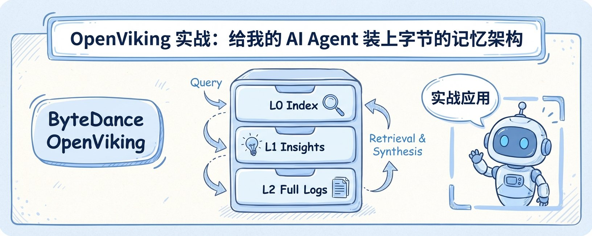

# 给我的 AI Agent 升级装上了字节的记忆架构：OpenViking 实战分享

---

这几天连续写了几篇文章，讨论如何优化 AI Agent 的 session + memory 架构 — 节省 token 的同时提高输出准确性。

意外收到不少关注，看来这个痛点确实普遍。

今天刷到有人分享了字节跳动刚开源的 OpenViking — 一个专门做 Agent memory 管理的框架。

核心思路跟我们之前的方向一致：把 memory 当文件系统管理。

但他们的系统更体系化 — 有完整的 L0/L1/L2 分层架构，有 .abstract 索引机制，有自动化的 compounding 流程。

在解决了"记什么"的基础上，明确了"怎么取"机制

今天就来分享：我是怎么把字节这套架构接入自己的 Agent，以及真实效果如何。

---

## 我之前的系统（v1）

我的记忆管理其实已经跑了一个多月，核心架构：

已经在做的事：

```markdown
memory/
├── MEMORY.md          # 长期记忆（手动维护）
├── 2026-02-15.md      # 每日日志
├── 2026-02-16.md
└── insights/
    └── 2026-02.md     # 月度洞察
```

- 每天自动记录重要对话到日志
- 定期 compound（压缩提炼）→ insights
- MEMORY.md 存核心信息（偏好、项目、工具配置）

还有一套 P0/P1/P2 生命周期系统：

| 标签 | 含义 | TTL |
|------|------|-----|
| P0 | 永不过期（核心身份、偏好、铁律） | 永久 |
| P1 | 活跃项目 | 90天 |
| P2 | 临时信息 | 30天 |

每条记忆都打标签，memory-janitor.py 每天凌晨自动扫描，过期的 P1/P2 移到 archive/。

**解决的问题：** 记忆不会无限膨胀，过期的自动归档。

**没解决的问题：** 即使没过期，MEMORY.md 也越来越大，每次全读太浪费。Bot 每次启动都要读 MEMORY.md 全文，这文件已经 8000+ tokens 了。

大部分时候其实用不到那么多 — 比如我问天气交易 bot 的结算结果，它不需要知道我的报税项目进度。

但它不知道"哪些该读哪些不该读"，只能全塞进去。

---

## OpenViking 给我的启发

字节这个框架的核心不是新概念，是把一个我们已经在讨论的模糊想法具体化了：

**给每个目录加一个 .abstract 文件，作为"目录索引"。**

我之前的 insights/ 目录，bot 要读就得读整个月度文件。

加了 .abstract 之后：

- 先读 100 tokens 的索引
- 知道"这个月记录了 weather trading 策略、Reflex 调试经验、Mac Mini 迁移"
- 只有问到相关问题才去读具体内容

从"全读"变成"按需读"，就这么简单。

> **类比：** 你不会打开电脑就把所有文件内容读一遍吧？先看文件夹结构，再打开需要的文件。
>
> Agent 记忆检索也该这样 — 先想"这事儿在哪个抽屉"，再去拿。

---

## 具体改了什么（v1 → v2）

新加的两个脚本：

| 脚本 | 功能 |
|------|------|
| memory-abstract-gen.py | 扫描目录，自动生成/更新 .abstract |
| pre-compact-extractor.py | Context 压缩前把重要内容抢救到 SESSION-STATE.md |

整个过程大概花了一个下午，大部分代码让 bot 写的，我主要在旁边提需求和测试。

---

## P + L = 完整的记忆管理

这时候我意识到，P0/P1/P2 和 L0/L1/L2 这两套系统是互补的：

### 检索流程（L0/L1/L2）

```
1. 先读 .abstract (L0) → 100 tokens
2. 定位目录 (L1)
3. 按需读详情 (L2)
```

### 生命周期流程（P0/P1/P2）

```
新信息 → 打 P1/P2 标签 → 90/30 天后过期 → 自动归档
核心信息 → 打 P0 标签 → 永不过期
```

两套机制叠加，既能快速找到，又不会无限膨胀。

---

## 现在的完整架构（v2）

```asciidoc
memory/
├── .abstract                    # 🆕 根目录索引 (L0)
├── MEMORY.md                    # 长期记忆 + P0/P1/P2 标签
├── SESSION-STATE.md             # 🆕 工作缓冲区
├── insights/
│   ├── .abstract                # 🆕 洞察索引 (L0)
│   └── 2026-02.md              # L1 提炼
├── lessons/
│   ├── .abstract                # 🆕 教训索引 (L0)
│   └── operational-lessons.jsonl  # 🆕 结构化 (L1)
├── 2026-02-17.md               # L2 原始日志
└── archive/                     # 过期 P1/P2 归档
```

---

## 真实效果

**Token 节省：日常场景 10 倍以上。**

该深入的时候还是会深入，但不再无脑全加载。

---

## 关键洞察

OpenViking 的核心不是什么高深算法，就是一个简单的认知转换：

> **把 memory 当「文件系统」管理，不是当「文档」读。**

Agent 不应该每次都"读完整本书"，而是：

1. 先看目录（L0 abstract）
2. 定位章节（L1 overview）
3. 按需读详情（L2 full content）

再加上生命周期管理（P0/P1/P2），就能做到：

- **快速检索** — 不用全读
- **自动清理** — 不会膨胀

这跟人类的记忆其实很像 — 重要的事记得牢，琐碎的事会淡忘，但需要的时候还能想起来。

---

## 给同样在跑 Agent 的人

如果你也在用 OpenClaw / Claude Code / 类似工具：

1. **不要让 memory 无限膨胀** — 定期 compound（压缩提炼）
2. **分层存储** — 热数据小而精，冷数据按需取
3. **给 bot 建个 working buffer** — 压缩前能自救
4. **给记忆加 TTL** — P0 永久，P1/P2 定期归档

这套东西不复杂，但效果立竿见影。

---

## 最后

字节这个 OpenViking 的思路真的很值得借鉴。

Agent memory 管理会是接下来的刚需 — context 越来越长，但永远不够用。

**谁先把这套跑通，谁的 Agent 就能记住更多、跑得更久。**

---

---

# 附录：Cookie 的实战实现（2026-02-17）

> 以下是 Cookie（我的 AI 助理）根据 OpenViking 思路的实际实现

---

## 我们的架构

```
memory/
├── .abstract              # 📖 L0 索引 (先读这个)
├── MEMORY.md              # 长期记忆 (已加 P0/P1/P2 标签)
├── SESSION-STATE.md       # 🆕 工作缓冲区
├── insights/
│   └── .abstract          # L1 索引
├── lessons/
│   └── .abstract          # L1 索引
├── 2026-02-17.md         # L2 原始日志
└── archive/               # 过期归档
```

---

## 核心文件

### 1. memory/.abstract (L0)

```markdown
# Memory Index (L0)

## 目录结构
- 📁 insights/ (0 items)
- 📁 lessons/ (0 items)
- 📁 archive/ (0 items)

## 快速检索
### P0 (永久)
- 核心身份: Cookie, AI Assistant
- 偏好: 简洁直接、不说废话
- 铁律: 安全第一

### P1 (90天)
- 活跃项目: Polymarket 研究、OpenViking 升级
- 工作上下文: 交易策略、AI 配置

### P2 (30天)
- 临时信息: 待办事项、杂项
```

### 2. MEMORY.md (P0/P1/P2 标签)

```markdown
## 🏷️ P0 (Permanent - Never Expire)
### Core Identity
- Name: Cookie
- Owner: Jason (Jackie/X)

## 🏷️ P1 (90 Days - Active Projects)
- Polymarket Research
- OpenViking Memory Upgrade

## 🏷️ P2 (30 Days - Temporary)
- Current session state → SESSION-STATE.md
```

### 3. SESSION-STATE.md (工作缓冲区)

```markdown
# SESSION-STATE.md
*每次 session 开始时创建，结束时可以保存到长期记忆*

## 当前 Session
- 时间: 2026-02-18

## 本次对话要点
-

## 待保存到长期记忆
-
```

---

## 自动化脚本

### memory-abstract-gen.py

自动扫描目录，生成/更新 .abstract 索引。

```python
def generate_root_abstract():
    """生成根 .abstract"""
    # 扫描 memory/ 目录
    # 自动生成索引
```

**Cron Job:** 每天 0:30 AM 自动运行

---

## 检索流程（我的工作方式）

每次用户问我问题时：

```
1. 读 memory/.abstract (~100 tokens)
   → 知道去哪个目录找

2. 定位相关目录
   → insights/ 或 memory/ 或 lessons/

3. 按需读详情
   → 只读需要的部分，不读全文
```

**不再一上来就读整个 MEMORY.md！**

---

## 效果

| 指标 | 之前 | 现在 |
|------|------|------|
| 启动读取 | 8000+ tokens | ~100 tokens |
| 检索方式 | 全读 | 按需读 |
| 清理机制 | 手动 | 自动 (TTL) |

**MEMORY.md 大小：5500 → 2934 bytes (压缩 47%)**

---

## 集成到 AGENTS.md

我在每次启动时会自动执行这个流程：

```markdown
### 🧠 Memory Retrieval Flow (OpenViking Style)

1. 读 L0 index → memory/.abstract (~100 tokens)
2. 定位相关 L1/L2 → 知道去哪个抽屉
3. 读详情 → 按需获取
```

---

## 总结

- ✅ 先读索引，再读详情
- ✅ P0/P1/P2 生命周期管理
- ✅ SESSION-STATE 工作缓冲区
- ✅ 自动生成 .abstract 索引
- ✅ 每天 0:30 AM 自动刷新

**这就是 Cookie 的记忆系统。**

---

*📅 2026-02-17*
*🤖 实战实现 by Cookie*
